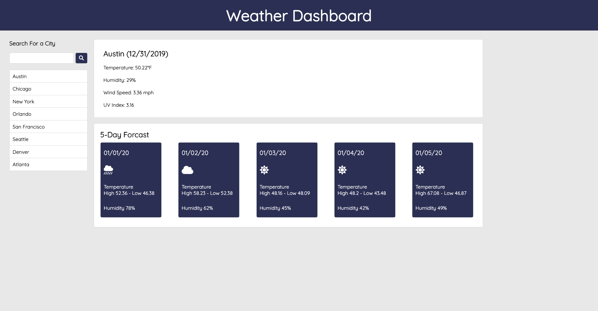

# Weather-Dashboard

Note: Google Chrome will not correctly call the weather api through http when my website is https. Have not found a solution yet. Use safari to view applicaiton.

Link to Website Here - https://livingkurt.github.io/Weather-Dashboard/
<!-- PROJECT LOGO -->
 

  <!--  -->

  <h3 align="center">Weather-Dashboard</h3>

  

    A stylish and simple way to view the weather in your area, or anywere you would like 
     
    <a href="https://livingkurt.github.io/Weather-Dashboard/">View Demo</a>
  

<!-- ABOUT THE PROJECT -->
## About The Project

I created a weather application, gives you the weather based on your location and allows a user to search the weather anywhere in the world as well.

### Features
* Automatic Location Prompt
* Search the weather in any city in the world
* Choose from a predetermined list of major City, to get a view of what the weather is like there.

### Built With

* [Open Weather Map](https://openweathermap.org/api)
* [Open Street Map](https://www.openstreetmap.org/#map=6/30.335/-97.712)
* [JQuery](https://jquery.com)

<!-- GETTING STARTED -->
## Getting Started

* Click [Here](https://livingkurt.github.io/Weather-Dashboard/) to view website.
* You will be asked to allow us to use your location
* Information from todays local weather and forcast will be displayed on the screen
* You now have to option to search for a new city in the search bar in the upper left or click on the any of the major cities to see there weather and forcast

## Front End

I first create a wire frame with html, and css. 
I find it very useful to get the styling and elements to an almost finished product before I start on any of the back end.
I had some issues getting the icons to show up correctly, but then realized I was using a outdated Fontawesome link tag

## Back End

Using Javascript I called on the open weather map api and open street map api to get all of my weather and location information.
Once I figure out what information I needed, it was pretty straight forward feeding it into my html elements.
Initially I wanted to create all of my html and css from javascript. But it seemed more daunting work than I thought.
And making html wireframe is quite relaxing.

